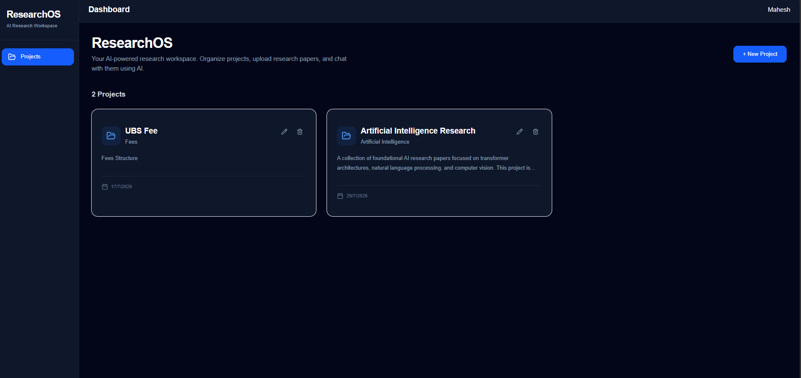
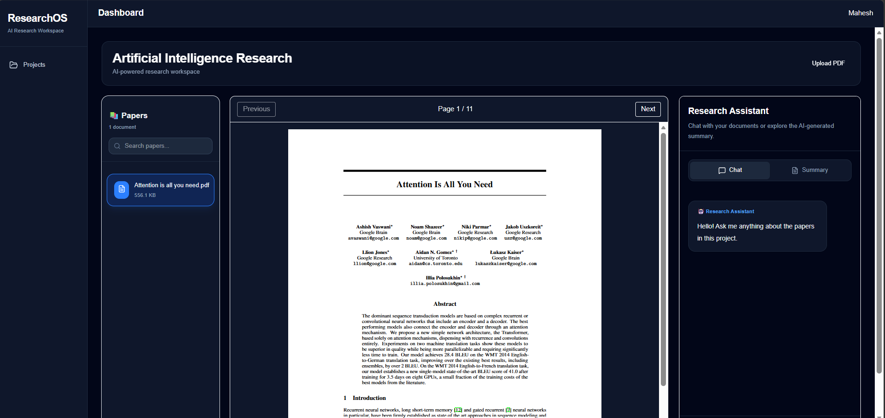
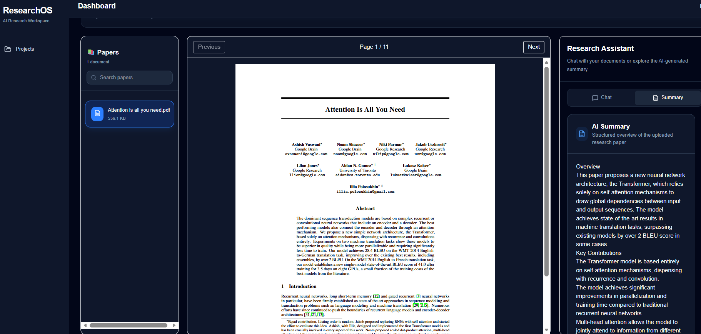
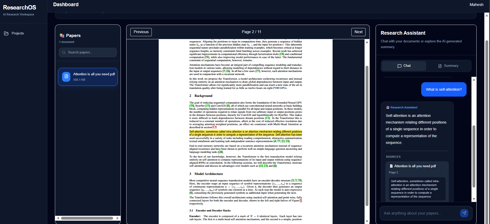

# ResearchOS

<p align="center">
  <h3 align="center">📚 AI-Powered Research Operating System</h3>
  <p align="center">
    Organize, summarize, and chat with research papers using Retrieval-Augmented Generation (RAG).
  </p>
</p>

---

## 🌟 Overview

ResearchOS is an AI-powered research assistant designed to simplify the process of reading and understanding academic papers.

It enables users to upload research papers, automatically generate structured summaries, and ask natural language questions with citation-backed answers. By combining semantic search with Retrieval-Augmented Generation (RAG), ResearchOS transforms static PDF documents into an interactive knowledge base.

---

## ✨ Features

### 📂 Project Management
- Create and manage multiple research projects
- Organize papers by research domain
- Clean and intuitive workspace

### 📄 PDF Processing
- Upload research papers
- Automatic text extraction
- Intelligent document chunking
- Metadata extraction

### 🤖 AI Research Assistant
- Ask questions in natural language
- Context-aware responses
- Citation-backed answers
- Click citations to navigate directly to the referenced PDF page

### 📝 AI Paper Summaries
- Automatically generated during upload
- Structured markdown summaries
- Overview
- Key Contributions
- Methodology
- Findings
- Conclusion

### 🔍 Semantic Search
- Local embedding generation
- ChromaDB vector database
- Fast semantic retrieval
- Context-aware document search

---

## 📸 Screenshots

### Dashboard




---

### Research Workspace




---

### AI Summary



---

### Citation-Based Chat

> *(Add chat screenshot here)*




## 🏗 Architecture

```text
                  Upload PDF
                       │
                       ▼
              Text Extraction
                       │
                       ▼
             Intelligent Chunking
                       │
                       ▼
          Embedding Generation
                       │
                       ▼
                  ChromaDB
                       │
                       ▼
         Semantic Retrieval (RAG)
                       │
                       ▼
               Ollama (Llama 3.2)
                       │
          ┌────────────┴────────────┐
          ▼                         ▼
   AI Summary Generation     Citation-Based Chat
```

---

## ⚙️ Tech Stack

### Frontend

- React
- TypeScript
- Tailwind CSS
- shadcn/ui
- React Router

### Backend

- FastAPI
- SQLAlchemy
- PostgreSQL

### AI Stack

- Ollama
- Llama 3.2
- ChromaDB
- Sentence Transformers

### PDF Processing

- PyMuPDF

---

## 🚀 Workflow

1. Create a research project.
2. Upload one or more PDF research papers.
3. Extract text from uploaded documents.
4. Split text into semantic chunks.
5. Generate embeddings for each chunk.
6. Store embeddings in ChromaDB.
7. Generate AI-powered paper summaries.
8. Retrieve relevant chunks based on user queries.
9. Generate citation-backed responses using a local LLM.
10. Navigate directly to cited pages inside the PDF.

---

## 💬 Example Questions

```
What problem does this paper solve?

Summarize the proposed methodology.

Explain the Transformer architecture.

What are the key contributions?

Compare the evaluation metrics.

What future work is suggested?

What limitations does the paper mention?
```

---

## 📁 Project Structure

```
ResearchOS
│
├── frontend/
│   ├── components/
│   ├── layouts/
│   ├── pages/
│   ├── services/
│   └── hooks/
│
├── backend/
│   ├── ai/
│   ├── api/
│   ├── database/
│   ├── models/
│   ├── services/
│   └── utils/
│
└── README.md
```

---

## 💡 Why ResearchOS?

Reading research papers often requires manually searching through long documents to locate relevant information.

ResearchOS simplifies this workflow by combining semantic search and Retrieval-Augmented Generation (RAG), allowing users to interact with research papers through natural language while maintaining transparency with citation-backed answers.

---

## 🔮 Future Roadmap

- Literature Review Agent
- Multi-document comparison
- Research gap identification
- Citation verification
- Knowledge Graph visualization
- Paper recommendation engine
- LangGraph-based multi-agent orchestration

---

## 🛠 Installation

### Clone the Repository

```bash
git clone https://github.com/yourusername/ResearchOS.git
```

```bash
cd ResearchOS
```

### Backend

```bash
cd backend

python -m venv .venv

source .venv/bin/activate
```

Windows

```powershell
.venv\Scripts\activate
```

Install dependencies

```bash
pip install -r requirements.txt
```

Run backend

```bash
uvicorn app.main:app --reload
```

---

### Frontend

```bash
cd frontend

npm install

npm run dev
```

---

## 📌 Future Improvements

- Multi-agent research workflows
- Collaborative workspaces
- Research paper recommendation system
- Export AI-generated notes
- Knowledge graph visualization
- Cross-paper literature review generation

---

## 👨‍💻 Author

**Mahesh Chandra**

M.Sc. Computer Science (Data Science)

Interested in Artificial Intelligence, Machine Learning, Retrieval-Augmented Generation (RAG), and Intelligent Research Systems.

LinkedIn: https://www.linkedin.com/in/mahesh-chandra26/

---

## ⭐ Support

If you found this project useful, consider giving it a ⭐ on GitHub.
